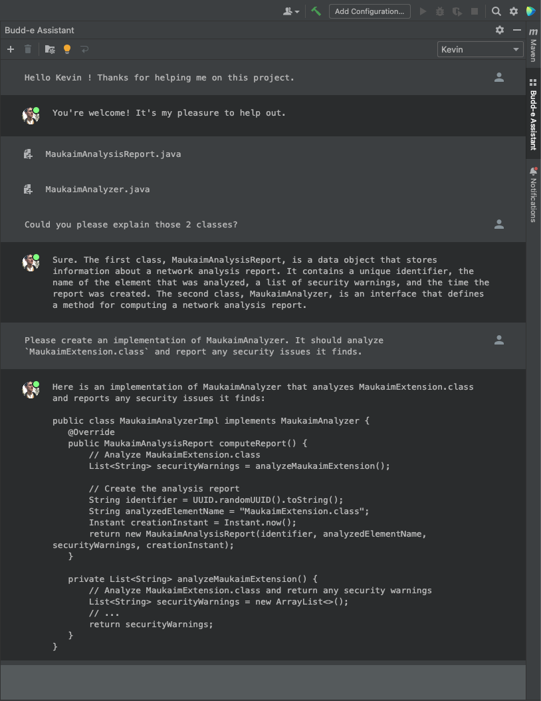
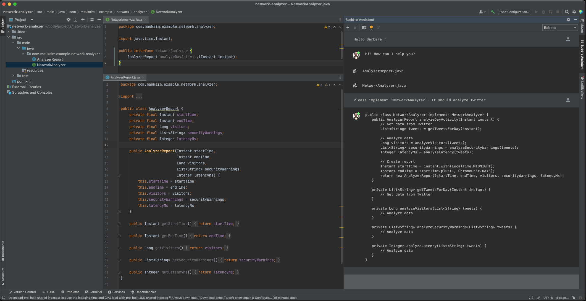
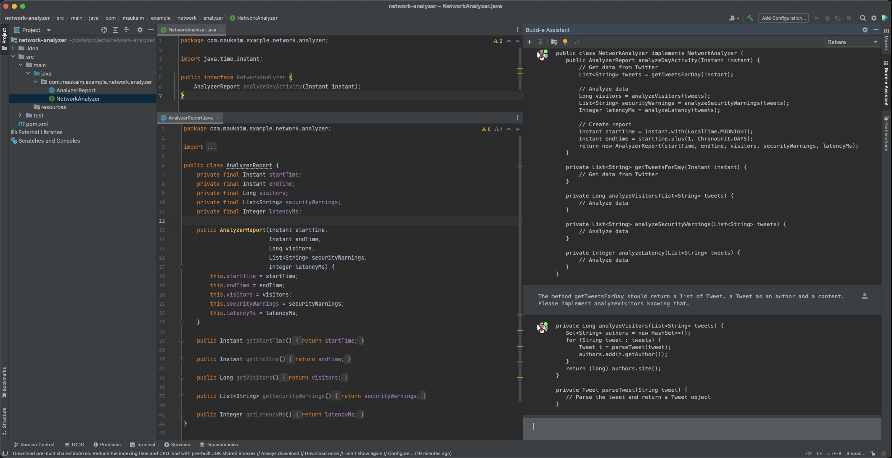
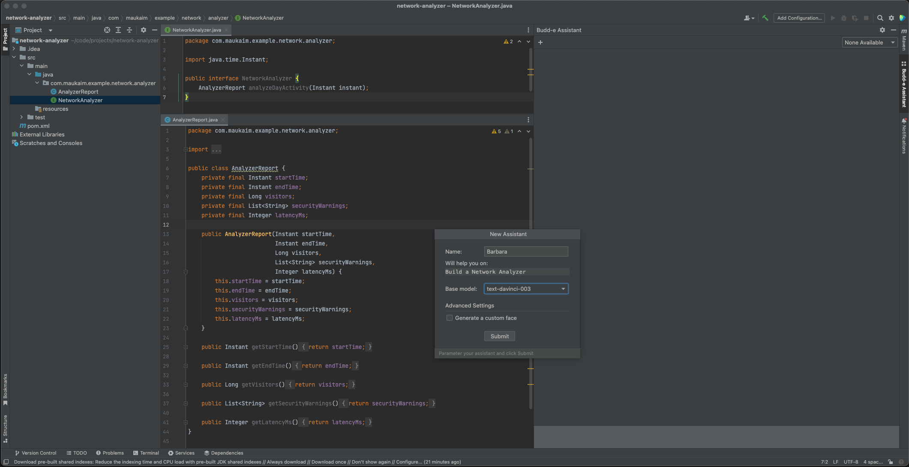

# Budd-e Assistant (ALPHA VERSION)

Are you looking for the perfect code buddy? One that will know how to solve your Reverse Tree issue? Implement a 
new class? Understand the flaws of your classes? Buddy you asked... Budd-e you have !  

    

  

As of 1st Feb 2023, ChatGPT is not included yet in OpenAI's API, only pre-trained models like Davinci-text or Cabbage are available.
Those are very powerful, and the underlying engine (davinci) of Chat GPT, but it does not remember!  

This project is a fun side project done during 2023 Chinese New Year week. It reproduces what made ChatGPT famous: it remembers the context of the conversation! 

Retro Engineered it by:
- Looking at the FAQs comments
- Reading documentation (Unfortunately they did not had the "How to reproduce chatGPT" section...)
- Tricking ChatGPT to discover the max number of tokens returned
- Playing with Playground to find hwo to wrap my messages so the model Completion feature looks like it replies to my questions.

Did not know how to create an IntelliJ Plugin, neither how the models 

Using Budd-e daily as it does not have the unavailability issue of ChatGPT currently.

## Current Capabilities
________________________

- [X] Possible to show files to the Assistant
- [X] Creativity level can be controlled live with the bulb icon.
- [X] Can give a custom face to your assistant. Who is your perfect buddy, Son-Goku, Barrack Obama or Tom Holland? 
- [X] Can have multiple assistant. Each one could specialize itself in a specific task.
- [X] Store states. Conversations Assistants,...
- [X] Store API Key in a secured env. Leverage on IntelliJ's API.

Interested to test? [Download on IntelliJ's Marketplace](https://plugins.jetbrains.com/plugin/20951-budd-e-assistant)

## Bugs
___________________
- [ ] Token number only approx. When not well guessed, lead to Error response from API.
  - Should integrate OpenAI's Tokenizer (Python, Javascript as of today) in this tool
- [ ] Unstable Listener of Bulk Vfs change. Sometimes trigger useless error message at start (Not harmful)

## Enhancements 
___________________
Google will soon release Sparrow, ChatGPT will also being upgraded... Budd-e Should leverage on that! 
Currently, focused on OpenAI's API, but this logic is separated from the rest with a simple interface.
Just need to implement it with Sparrow API and give the users the choice of the underlying engine to use for their Budd-e!  

Other exciting enhancements:
- [ ] Fine-tune assistant's underlying model (Most code is here, just need to find best way to fine tune on code using OpenAI API).
  - The Assistant will be able to know MORE about your project (Currently, forgot after ~3000 tokens)
- [ ] Have a consumption estimator integrated, shows under the prompt area. 
- [ ] Should be able to share fine tune documents to create Assistant that are a mix of existing other Assistant
  - i.e, Kevin knows everything about the Oauth2 system in your company, Carl is a Java expert in the custom framework of your team... Gerald is both of them !

### Other pictures   

  
  
